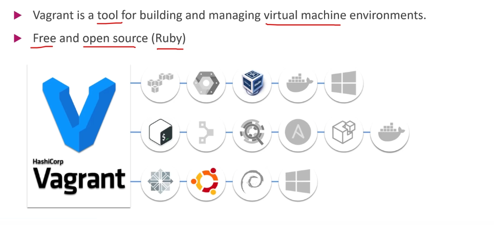
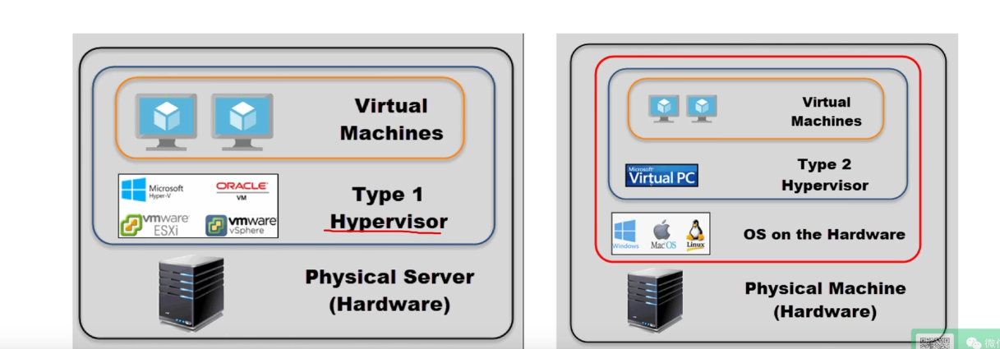
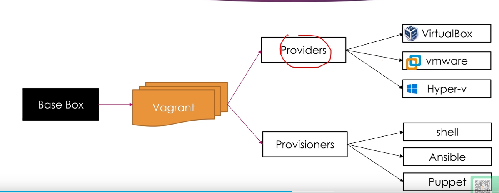
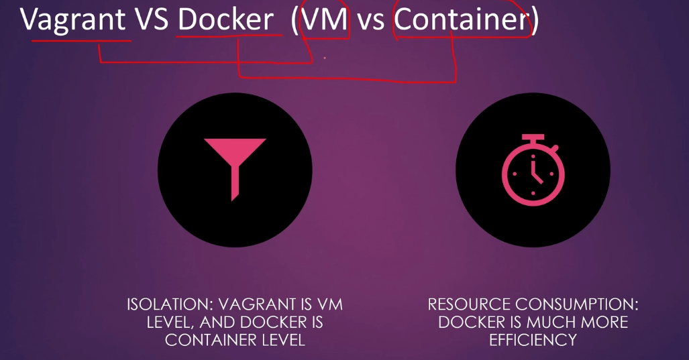

# Vagrant 上手

## 1-1 Vagrant 介绍

### What is Vargrant

- Vagrant is a tool for building and managing virtual machine environments.
- Free and open source (Ruby)



### Virtualization



### How vagrant works?

Provisioners



### Vagrant VS Docker (VM vs Container)



### Vagrant VS Terraform

- Vagrant is a tool focused for managing development environments
- Terraform is a tool for building infrastructure

## 1-2 Vagrant 的安装

### Vagrant、Hyper-V/VirtulBox下载

- http://vagrantup.com

- http://docs.microsoft.com

- http://virtualbox.org 

- 验证安装是否成功

  ```shell
  vagrant --version
  ```

## 1-3 通过 Hyper-v 创建第一个 Vagrant Host

1. 打开 Vagrant Cloud官网: https://app.vagrantup.com/boxes/search

2. 使用 [generic](https://app.vagrantup.com/generic)/[ubuntu2004](https://app.vagrantup.com/generic/boxes/ubuntu2004) 

   ```bash
   $ cd E:\linux
   $ mkdir vagrant_demo
   $ cd vagrant_demo
   $ vagrant init generic/ubuntu2004
   $ vagrant up --provider=hyperv --color
   $ vagrant status
   ```

   

## 1-4 通过 VirtualBox 创建第一个 Vagrant Host

1. 使用 [generic](https://app.vagrantup.com/generic)/[centos7](https://app.vagrantup.com/generic/boxes/centos7)

   ```bash
   $ cd E:\linux
   $ mkdir vagrant_virtualbox
   $ cd vagrant_virtualbox
   $ vagrant init generic/centos7
   $ vagrant up --provider=virtualbox
   $ vagrant status
   ```

   

## 1-5 国内下载 Vagratn Box 慢怎么办

```bash
$ vagrant box list
$ vagrant box add centos7 https://mirrors.ustc.edu.cn/centos-$cloud/centos/7/vagrant/x86_64/images/CentOS-7.box --provider=hyperv # --provider=virtualbox
$ vagrant init centos7
```

## 1-6 Vagrant 的基本操作

### Vagrant basic CMD

- Start: `vagrant up`
- Check status: `vagrant status`
- SSH Connect: `vagrant ssh <name>`
- SSH cfg: `vagrant ssh-config`
- Suspend/resume/reload/stop: `vagrant suspend/resume/reload/halt <name>`
- Delete/Remove: `vagrant destroy <name>`

## 1-7 Vagrant 的 ssh config

1. hyperv里的 `vagrant ssh-config`

   ```yaml
   Host default
     HostName fe80::215:5dff:fe38:100 #  默认是分配的地址加22端口
     User vagrant
     Port 22
     UserKnownHostsFile /dev/null
     StrictHostKeyChecking no
     PasswordAuthentication no
     IdentityFile E:/linux/vagrant_demo2/.vagrant/machines/default/hyperv/private_key
     IdentitiesOnly yes
     LogLevel FATAL
   ```

2. virtualbox里的`vagrant ssh-config`

   ```yaml
   Host default
     HostName 127.0.0.1 # 默认是127.0.0.1,本地地址加不同端口
     User vagrant
     Port 2222
     UserKnownHostsFile /dev/null
     StrictHostKeyChecking no
     PasswordAuthentication no
     IdentityFile E:/linux/vagrant_virtualbox/.vagrant/machines/default/virtualbox/private_key
     IdentitiesOnly yes
     LogLevel FATAL
   ```

## 1-8 VirtualBox 和 Hyper-V 共存