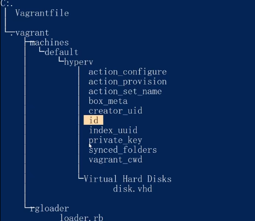

# 2 Vagrantfile

## 2-1 和 Vagrant 相关的几个文件夹

### Vagrantfile 文件

```ruby

Vagrant.configure("2") do |config|
  config.vm.box = "centos7"
end
```

### .vagrant 文件夹



###  用户家目录里的 .vagrant.d/ 文件夹

```bash
cd ~
cd ./.vagrant.d/
tree /F
## boxes 下是存镜像的
```

## 2-2 Vagrant VM 的设置

1. 初始化配置

   ```bash
   vagrant init centos/7
   ```

2. 配置 Vagrantfile 文件(Ruby语法)

   ```ruby
   # 默认的配置
   Vagrant.configure("2") do |config|
     config.vm.box = "centos/7"
   end
   
   # 添加的配置
   Vagrant.configure("2") do |config|
     config.vm.box = "centos/7"
       # 配置主机名
     config.vm.hostname = "vagrant-demo"
     # 配置版本
     config.vm.box_version = "1905.1"
   end
   ```

   

## 2-3 关于Vagrant 的 SSH 链接 

### 修改 vagrant 的登录方式

```bash
# 使用ssh免密登录虚拟机
vargrant ssh
# 查看sshd的配置文件
cd /etc/ssh
sudo more sshd_config
# 修改密码登录权限
vim /etc/ssh/sshd_config
# 把 PasswordAuthentication 修改为 yes
# 重启sshd服务
sudo service sshd restart
```

### config 的本地配置

2. 查看config, 把内容复制

   ```bash
   # 查看config, 把内容复制
   vagrant ssh-config
   ```

3. 在用户目录的 .ssh 目录下新建一个txt文件

4. 把复制的内容复制到.txt文件里, `Host default` 可以修改成 `Host vagrant-host`

   ```
   Host vagrant-host
     HostName 127.0.0.1
     User vagrant
     Port 2200
     UserKnownHostsFile /dev/null
     StrictHostKeyChecking no
     PasswordAuthentication no
     IdentityFile E:/linux/vagrant_demo/.vagrant/machines/default/virtualbox/private_key
     IdentitiesOnly yes
     LogLevel FATAL
   ```

   

5. 修改.txt文件名为 config

6. 这样在任意目录下都可以登录虚拟机了

   ```bash
   # 使用ssh全局命令即可登录
   ssh vagarnt-host
   ```

## 2-4 Vagrant SSH Key 的一点补充

1. 设置Vagrantfile

   ```ruby
   config.ssh.insert_key=false // 使用insecure_private_key不安全
   ```

2. 重新开启box

   ```
   vagrant destroy -f
   vagrant up
   vagrant ssh-config
   vagrant ssh
   exit
    ssh -i C:/Users/Administrator/.vagrant.d/insecure_private_key vagrant@127.0.0.1 -p 2222
   ```

## 2-5 一个 Vagrantfile 创建多个 Host

1. 在vagrantfile里设置

   ```ruby
   Vagrant.configure("2") do |config|
     config.vm.box = "centos/7"
     config.vm.hostname = "vagrant-demo"
     config.vm.box_version = "1905.1"
     config.ssh.insert_key=false
     config.vm.define "web-server" do  |web| 
       web.vm.hostname = "web"
       web.vm.box_version = "2004.01"
     end
     config.vm.define "database" do |db| 
       db.vm.hostname = "db"
     end
   end
   ```

2. 重新创建

   ```ruby
   vagrant destroy -f
   vagrant up
   ```


## 2-6 Vagrant 的改进

1. 使用循环修改Vagrantfile

   ```ruby
   host_list = [
     {
       :name => "host1",
       :box => "centos/7"
     },
     {
       :name => "host2",
       :box => "centos/7"
     },
     {
       :name => "host3",
       :box => "generic/centos8"
     },
   ]
   
   Vagrant.configure("2") do |config|
     host_list.each do |item|
       config.vm.define item[:name] do |host|
         host.vm.box = item[:box]
       end
     end 
   end
   ```

2. ```
   vagrant status
   vagrant up
   ```

## 2-7 Sync Folder 如何同步文件

1. 打开如下文件

   ```bash
   cd ~
   cd .vagrant.d/
   cd boxs/
   cd centos-.../
   cd 2004.01/
   cd virtualbox/
   ls
   code Vagrantfile
   ```

2. 修改文件内容

   ```ruby
   Vagrant.configure("2") do |config|
     config.vm.base_mac = "5254004d77d3"
     # config.vm.synced_folder ".", "/vagrant", type: "rsync"
   end
   
   ```

3. 安装 vagrant 的插件

   ```bash
   # 查看 已安装的插件
   vagrant plugin list
   vagrant plugin install vagrant-vbguest
   ```

4. 重新启动box

   ```
   vagrant destroy -f
   vagrant up
   ```

## 2-8 Hyper-V 和 文件同步

1. 查看PowerShell版本:必须大于等于3

   ```powershell
    Get-Host | Select-Object Version
   ```

2. 修改Vagrantfile

   ```ruby
   host_list = [
     {
       :name => "host1",
       :box => "centos/7"
     }  
   ]
   
   Vagrant.configure("2") do |config|
     host_list.each do |item|
       config.vm.define item[:name] do |host|
         host.vm.box = item[:box]
         host.vm.synced_folder ".", "/vagrant", type: "smb"
       end
     end 
   end
   ```

3. 重启box

   ```bash
   vagrant up
   ```

## 2-9 一个同时适应 Hyper-V 和 VirtualBox 的Vagrantfile

1. 修改Vagrantfile

   ```ruby
   host_list = [
     {
       :name => "host1",
       :box => "centos/7"
     }  
   ]
   
   Vagrant.configure("2") do |config|
     
     config.vm.provider "hyperv" do |v|
       config.vm.synced_folder ".", "/vagrant", type: "smb"
     end
     config.vm.provider "virtualbox" do |_,override|
       config.vm.synced_folder ".", "/vagrant", type: "virtualbox"
     end
   
     host_list.each do |item|
       config.vm.define item[:name] do |host|
         host.vm.box = item[:box]
       end
     end 
   end
   ```

   

