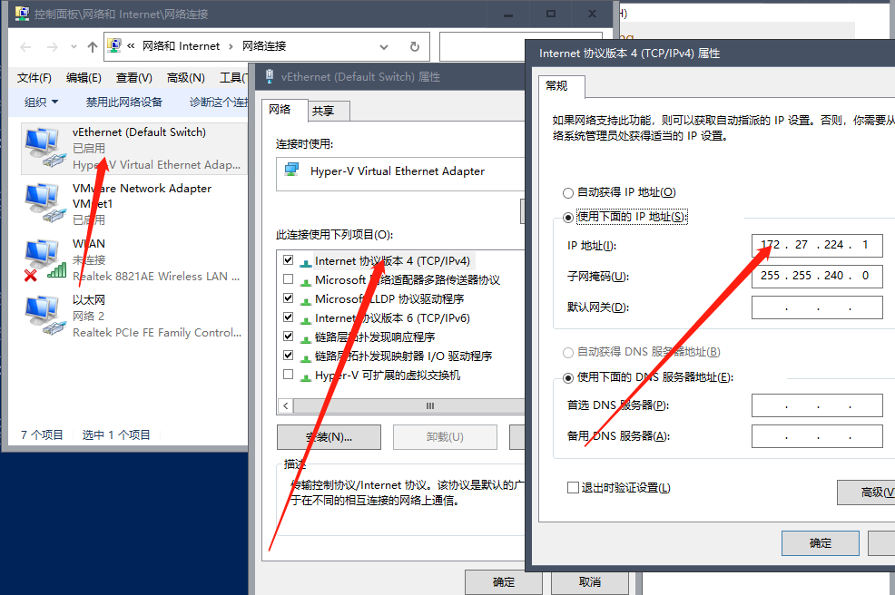
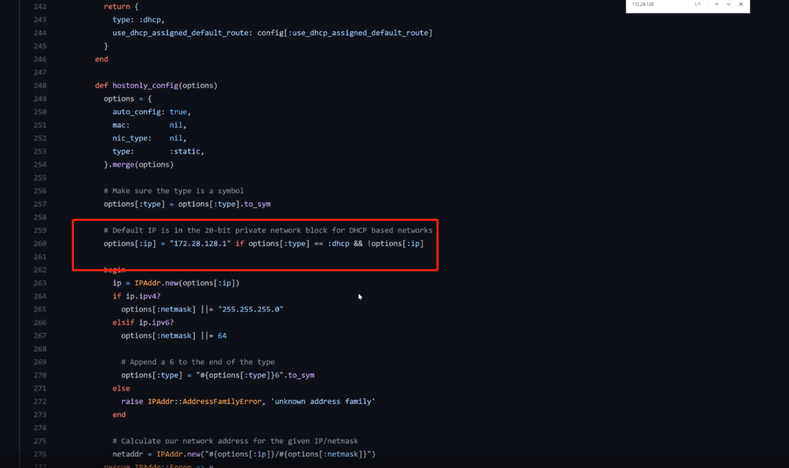
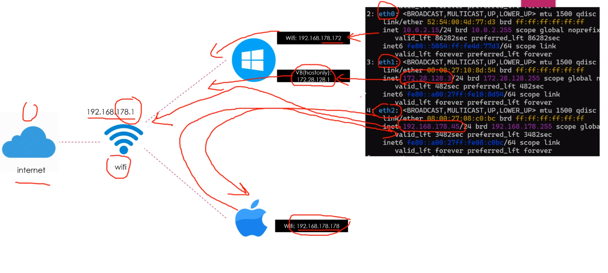

#  4 Networking

## 4-1 SSH Network 

1. virtual box里的虚拟机设置里 Network选项 NAT; 地址转发选项

2. 进入虚拟机

   ```bash
   $ vagrant ssh
   # 查看虚拟机的网络接口
   # 这里查的地址是内部地址, 在外部不能 ping
   $ ip -c a
   ```

3. hyperv的

   ```bash
   # 查看hyperv的hostname
   $ vagrant ssh-config
   # 进入虚拟机查看网络
   $ vagrant ssh
   $ ip -c a
   ```

4. 打开hyperv; 选择虚拟机; 右键 设置选项; Network Adapter选项是 Default Switch(网络连接里的); 在这个网段里面。

   

## 4-2 Forwarder Port 端口转发

- 访问 virtual box 里的虚拟机安装的 nginx

  1. 安装 nginx

     ```bash
     $ vagrant ssh
     $ sudo yum install epel-release
     $ sudo yum install nginx
     $ sudo systemctl restart nginx
     $ sudo systemctl status nginx
     $ curl 127.0.0.1
     $ ip a
     ```

  2. 设置virtual box里虚拟机的网络配置: 添加一条端口转发规则

     | Name  | Protocol | Host IP   | Host Port | Guest IP | Guest Port |
     | ----- | -------- | --------- | --------- | -------- | ---------- |
     | ssh   | TCP      | 127.0.0.1 | 2222      |          | 22         |
     | nginx | TCP      | 127.0.0.1 | 8000      |          | 80         |

  3. 在外部访问 127.0.0.1:8000 即可

- 通过Vagrantfile配置自动的 端口转发规则 (只对virtual box 生效)

  1. 删除virtuai box配置好的端口转发规则

  2. 打开 Vagrantfile

     ```ruby
     Vagrant.configure("2") do |c|
     	config.vm.network "forwarded_port", guest: 80, host: 8080
     end
     ```

  3. 重启虚拟机
  
     ```bash
     $ vagrant reload
     $ vagrant ssh
     $ sudo systemctl start nginx
     ```
  
  4. 访问 127.0.0.1:8080 即可访问nginx

## 4-3 Private Network和 静态 IP

配置 Vagrantfile使virtualbox里的虚拟机可以相互通信

```Ruby
host_list = [
    {
        :name => "host1",
        :eth1 => "192.169.50.10"
        },
    {
        :name => "host2",
        :eth1 => "192.169.50.11"
        }
    ]

Vagrant.configure("2") do |config|
    config.vm.box = "centos/7"
    host_list.each do |item| 
        config.vm.define item[:name] do |host|
            host.vm.hostname = item[:name]
            # 这里的配置只能适用于virtualbox, 不能用于hyperv
            host.vm.network "private_network", ip: item[:eth1]
        end 
    end    
end
```

## 4-4 Private Network和DHCP

1. 上节使用了静态的ip, 本机使用动态的: 一般来说使用固定的更稳定些。

   ```ruby
   host_list = [
       {
           :name => "host1",
           :eth1 => "192.169.50.10"
           },
       {
           :name => "host2",
           :eth1 => "192.169.50.11"
           }
       ]
   
   Vagrant.configure("2") do |config|
       config.vm.box = "centos/7"
       host_list.each do |item| 
           config.vm.define item[:name] do |host|
               host.vm.hostname = item[:name]
               # 这里的配置只能适用于virtualbox, 不能用于hyperv
               host.vm.network "private_network", type: "dhcp"
           end 
       end    
   end
   ```

2. 重启会重新配置一个 172.28.128.1 的网卡; 下次再重新启动, 会继续使用这个网段(vagrant源码里配置的)

   

## 4-5 Public Network 详解

1. private_network 是只有本机能访问

2. public_network 可以远端访问 (bridged)

   ```ruby
   Vagrant.configure("2") do |config|
       # 默认使用dhcp分配
       config.vm.network "public_network"
   end
   ```

3. 设置静态ip

   ```ruby
   host_list = [
       {
           :name => "host1"
           },
       {
           :name => "host2"
           }
       ]
   
   Vagrant.configure("2") do |config|
       config.vm.box = "centos/7"
       host_list.each do |item| 
           config.vm.define item[:name] do |host|
               host.vm.hostname = item[:name]
               host.vm.network "private_network", type: "dhcp"
               host.vm.network "public_network"
           end 
       end    
   end
   ```

5. eth0、eth1、eth2 和 Adapter 的链接关系

   

   - eth0: 通过网络地址转换 NAT 使用windos主机的wifi地址来访问internet
   - eth1: 通过 HostOnly; 访问VB网卡, 但是不能访问wifi->internet
   - eth2: 通过bridged; 和windows、maxOs主机都是直接使用wifi分配的ip地址；可以通过wifi访问internet,以及同一wifi下的maxOs主机

6. 通过eth2来同一wifi下的网络设备 (我的wifi是192.168.0.1)

   ```bash
   ping 192.168.128.1
   ping 192.168.128.178
   ```

6. ```ruby
   # 1端口转发规则
   =begin
   Vagrant.configure("2") do |config|
     # 可以配置多条转发规则
     config.vm.network "forwarded_port",guest: 80, host: 8080, host_ip: 127.0.0.1
   end
   =end
   
   # 2private_network
   host_list = [
     {
      :name => "host1",
      :eth1 => "192.168.50.10",
      :eth2 => "192.168.0.101"
     },
     {
       :name => "host1",
       :eth1 => "192.168.50.11",
       :eth2 => "192.168.0.101"
     }
   ]
   
   Vagrant.configure("2") do |config|
     config.vm.box = "centos7"
     host_list.each do |item|
       config.vm.define item[:name] do |host|
   
         host.vm.hostname = item[:name]
   
         # eth1: host-only网络, 通过 "VirtualBox Host-Only Ethernet Adapter #2" 这个适配器连接
         # 可以使用dhcp; 也可以设置成静态ip
         # host.vm.network "private_network", type: "dhcp"
         host.vm.network "private_network", ip:item[:eth1]
   
         # eth2: bridged 网络，直接通过wifi分配ip地址；可以通过wifi上网，以及访问同一wifi下的主机
         # 默认是dhcp分配，也可以配置静态ip
         # host.vm.network "public_network", bridged: 指定用于桥接的适配器
         host.vm.network "public_network", ip: item[:eth2], bridged:" Realtek 8821AE Wireless LAN 802.11ac PCI-E NIC" 
         
       end
     end
   end
   
   ```

   

